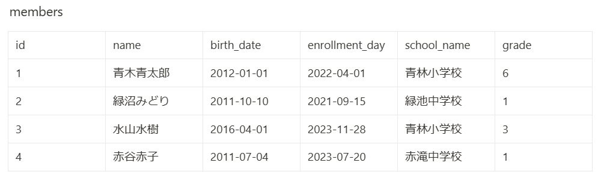

# 第9回課題 Serviceを利用したRead処理と例外処理の実装

## 概要

- 第８回で実装したAPIにServiceを追加し、Controller、Service、Mapperを利用するRead処理に作り変えた。
- 更に、例外をハンドリングする処理を実装した。

***

# 以前の課題↓↓↓

# 第８回課題 Read処理の実装

## 概要

- DockerでMysqlのローカル環境を構築した。
  ( https://github.com/yuik23/memberservice/commit/74fbde2353e386bd43e5514cbe0de45e13ab4c95#commitcomment-140116243 )
- MybatisでDB接続を行い、塾の会員管理データベースを作成、操作可能なAPIをSpringBootで実装した。

### ①Read処理の実装

以下のテーブルを作成し、レコードを全件取得するAPIを実装した。

membersテーブルではid、名前、生年月日、入会日、所属する学校、学年を管理する。

### ②クエリ文字を指定して検索するAPIの実装

school_name column で接尾文字「小学校or中学校」と grade column で学年を指定して同学年の会員を検索するAPIを実装した。
